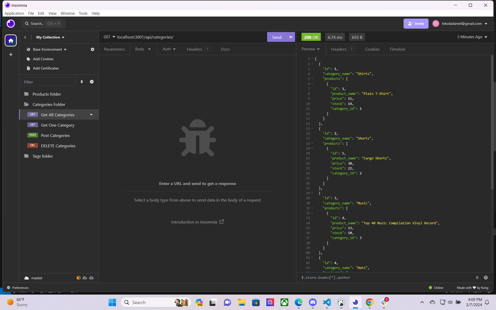

# E-commerce-Backend
  
  
    

  ## Description
  
  This project was creating Products, Tags, and catagories. Once you fill out the routes and the models it should run properly on insomnia and it should show GET and POST properly in the url for each one.
  
  ## Table of Contents 
  
  
  
  - [Installation](#installation)
  - [Usage](#usage)
  - [Credits](#credits)
  - [License](#license)
  
  ## Installation
  
npm i all dependencies dotenv, express, mysql2, sequelize

## Screen Recording
https://drive.google.com/file/d/1HjS7Yp4Pc5Kn5x-iC_7rY8_T32T5M285/view

updated screen recording of the working link in Insomnia
https://drive.google.com/file/d/17j-UX26HQF8ezSYKxCbLq00DALFhkf3I/view

## Screenshots

  ## Usage
  
  
 used in insomnia to to get the data for each output selected, for example when you POST it in the url it should bring you a preview of your expected data.
  
  
  
  ## License
  
A short and simple permissive license with conditions only requiring preservation of copyright and license notices. Licensed works, modifications, and larger works may be distributed under different terms and without source code.
  [https://choosealicense.com/licenses/mit/](https://choosealicense.com/licenses/mit/)

  
  ## How to Contribute
  Daniel Desta

  
  
  ## Tests
  npm start
